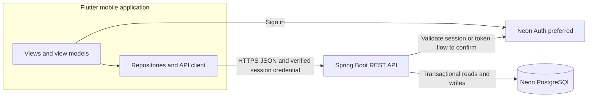
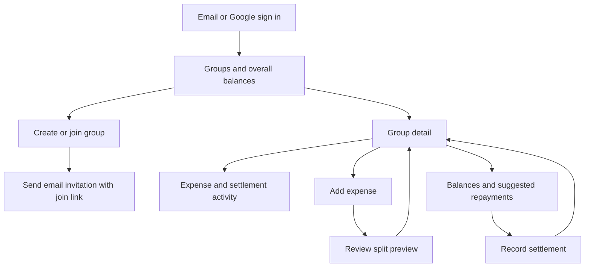
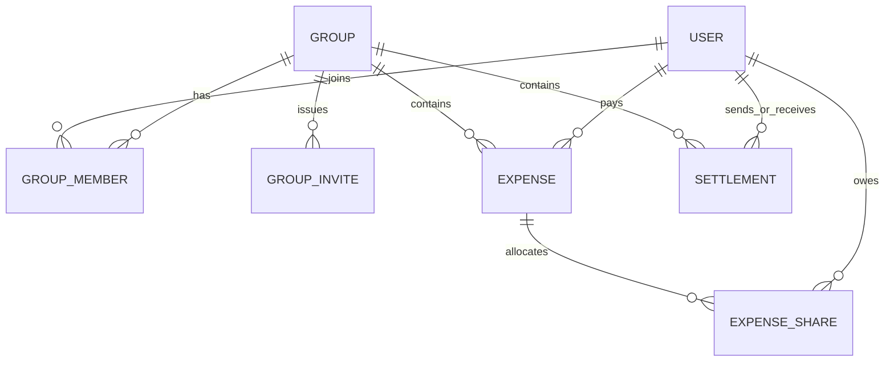

# FareShare Mobile Application Design

**Status:** Proposed design for a personal use, Android first MVP with an iOS release planned afterward. Mobile authentication integration remains to be validated.

FareShare helps a group record shared expenses, see who owes money, and record repayments. The architecture uses one Flutter mobile codebase, one Maven built Java Spring Boot API, and Neon hosted PostgreSQL. The MVP supports email and password or Google sign in. Mobile number sign in with an SMS one time password is planned for a later release. The API owns all money calculations so Android and iOS always show the same balances.

## Product Scope

The MVP supports email and password sign in, Google sign in, groups, invitations delivered by email with a join link, expenses with one payer, equal or exact amount splits, group balances, suggested repayments, and recorded offline settlements. A repayment changes balances only after the recipient confirms it. Group activity shows the history of expenses and settlements.

The launch country list contains the 22 countries below. Members may live in different supported countries. Each group chooses **one fixed currency** from the 18 currencies in the launch list when it is created; all of its expenses and settlements use that currency. Changing or converting currencies requires a separate future design. Mobile number and SMS sign in, percentage and share based splits, multiple payers, recurring expenses, receipt scanning, online payments, and full offline editing are later features.

### Supported Countries and Currencies

The selected country can suggest a default currency when creating a group, but the group creator may choose any currency in this supported set. Country selection does not restrict which supported-country members can join the same group. ISO currency codes are stored and used to disambiguate symbols such as `$` and `kr`; symbols and number placement are formatted for the viewer's locale.

| Country | Country code | Default currency | Currency code |
| --- | --- | --- | --- |
| Argentina | AR | Argentine peso | ARS |
| Australia | AU | Australian dollar | AUD |
| Austria | AT | Euro | EUR |
| Belgium | BE | Euro | EUR |
| Canada | CA | Canadian dollar | CAD |
| Denmark | DK | Danish krone | DKK |
| Germany | DE | Euro | EUR |
| India | IN | Indian rupee | INR |
| Ireland | IE | Euro | EUR |
| Kenya | KE | Kenyan shilling | KES |
| Malaysia | MY | Malaysian ringgit | MYR |
| Netherlands | NL | Euro | EUR |
| New Zealand | NZ | New Zealand dollar | NZD |
| Nigeria | NG | Nigerian naira | NGN |
| Norway | NO | Norwegian krone | NOK |
| Pakistan | PK | Pakistani rupee | PKR |
| Philippines | PH | Philippine peso | PHP |
| Singapore | SG | Singapore dollar | SGD |
| South Africa | ZA | South African rand | ZAR |
| Sweden | SE | Swedish krona | SEK |
| United Kingdom | GB | Pound sterling | GBP |
| United States | US | US dollar | USD |

This list defines FareShare's product scope, not a statement about where each currency is legal tender. Use the ISO 4217 code as the stable identifier and locale data to render the amount. Review the list when new countries or currencies are added.

## High Level Architecture

The phone is responsible for input, display, and a helpful split preview. The API verifies identity and group membership, validates every write, stores the ledger, and calculates balances and repayment suggestions. Neon supplies managed PostgreSQL. No client writes directly to the database.

## Technology Stack

| Area | Proposed choice | Reason |
| --- | --- | --- |
| Android and iOS app | Flutter with Dart | Share screens and application logic while releasing Android first. |
| App structure | Views, view models, repositories, services | Separates presentation from API access and supports testing. |
| Backend | Java with Spring Boot REST API | Clear home for authorization, transactions, and money rules. |
| Backend build | Maven | Manages Spring Boot dependencies and packages the API. |
| Persistence | Neon hosted PostgreSQL with Flyway migrations | Managed database with relational constraints and transactional writes. |
| Authentication | Neon Auth preferred, mobile integration pending | Must support email and password and Google sign in on Android and iOS. |
| Invitation email | Transactional email provider to select | Sends group join links; the API owns invite creation and acceptance. |
| API hosting | Run locally during development; choose a host before sharing the app | A remote mobile app needs a reachable HTTPS API. |
| Testing | Flutter unit and widget tests; Java unit and API integration tests | Covers input flows, calculations, authorization, and persistence. |

Neon's [October 2026 Free plan announcement](https://neon.com/blog/neon-free-plan-1-gb-per-project) states 1 GB of PostgreSQL storage and 100 CU hours of compute per project per month, plus managed authentication with up to 60,000 monthly active users. These are provider limits, not FareShare requirements; check the current plan before deployment. Local Flutter and Spring Boot development can use a Neon development branch. Hosting the Spring Boot API is a separate decision. Choose supported SDK and framework versions when implementation begins, then pin them in the project.

### Authentication Integration Gate

Neon Auth is the preferred provider for the first release because it is offered with Neon PostgreSQL and supports email and password and OAuth. Its published integration examples focus on JavaScript clients. Its session cookies and Data API JWT behavior must not be assumed to be an immediately usable bearer token flow for a Flutter app calling a separate Spring Boot API.

Before implementing account features, build a small end to end proof of concept that:

1. Signs in from Flutter with email and password or Google; restores the session after restarting the app.
2. Sends an authenticated request to Spring Boot over HTTPS without exposing a server secret in the app.
3. Lets Spring Boot validate the credential, reject an expired or invalid credential, and extract a stable user ID.
4. Links different sign in methods to the same account when the user chooses to do so, so a new method does not create a separate balance history.
5. Repeats the flow on iOS before its release, including sign out and account switching.

If Neon Auth does not fit the mobile and Spring Boot flow, use Firebase Authentication with Neon PostgreSQL. Firebase documents both Flutter sign in methods and server-side ID token verification. The API's identity module should hide provider-specific verification behind one interface.

Mobile number sign in with SMS OTP remains a future requirement. Its auth provider support, country availability, abuse controls, and per-message cost need a separate design before implementation. Firebase currently bills phone authentication per SMS and requires a pay as you go plan for verification SMS.

## Frontend Design

### Navigation and Screens

| Screen | Main content and action |
| --- | --- |
| Sign in | Email and password or Google; clear loading and error states. |
| Groups | Group name, currency code, the user's net balance, and create or join actions. |
| Create or join group | Pick a supported country to suggest a currency, choose from the supported currency list, invite by email, and open a join link. |
| Group detail | Members, total balance, recent activity, Add expense, and Settle up. |
| Add expense | Description, amount, date, payer, participants, split method, and editable shares. |
| Split preview | Each member's share and the resulting balances before saving. |
| Balances | Net balance per member and suggested payments to reach zero. |
| Settlement | Sender, recipient, amount, confirmation status, and history. |

Each feature follows **view → view model → repository → API service**. Views render state and collect actions. View models validate form input and represent loading, success, and error states. Repositories map API data into app models and refresh affected screens after a write. The app may cache recently viewed data for display, but the server remains the source of truth. The MVP requires a connection to submit changes.

Use a shared visual identity on both platforms while adapting navigation, back gestures, safe areas, keyboard behavior, and platform controls where appropriate. Provide readable money formatting, accessible labels, sufficient contrast, and layouts that work with larger text sizes.

### Main User Flows

**Add an expense:** A member enters an amount and selects a payer and participants. The app previews the split. On save, the API checks membership, currency, amount, and share totals, then saves the expense and shares in one transaction. The app refreshes activity and balances.

**Settle up:** A debtor records an offline payment to a creditor. It appears as pending. The recipient confirms or rejects it. Only a confirmed settlement affects balances. The app makes clear that recording a settlement does not transfer money.

**Invite a member:** A group member enters an email address. The API creates a single use, expiring join link and asks the email provider to deliver it. The recipient opens the link, signs in or creates an account, and confirms joining the intended group. Opening a link alone does not silently join a group.

**Edit an expense:** Only the member who created the expense sees the edit action. The API checks the creator's identity and the expense version, saves a valid correction, and retains an activity record of the change. The payer is a separate field and gains no edit permission merely by paying.

## Backend Design

### Modules and Responsibilities

| Module | Responsibility |
| --- | --- |
| Identity | Validate the selected provider's credential and map its stable user ID to a local user record. |
| Groups | Create groups, issue email invitations with join links, accept invites, and enforce membership. |
| Expenses | Validate and save expense details and exact member shares; allow creator only corrections. |
| Settlements | Record pending payments and recipient confirmation or rejection. |
| Balances | Calculate net balances from expenses and confirmed settlements. |
| Simplification | Produce suggested payments without changing recorded history. |
| Activity | Return an ordered history for the group. |

Start as **one deployable service** with these internal modules. Every endpoint checks the authenticated user's access to the requested group. The server never trusts a client supplied user ID for authorization.

### Core Data Model

| Record | Key fields |
| --- | --- |
| User | `id`, `auth_provider`, `auth_subject`, display name, email, timestamps. |
| Group | `id`, name, ISO currency code, creator, timestamps. |
| Group member | Group ID, user ID, role, joined time. |
| Group invite | Group ID, invited email, invite token hash, expiry, status, invited by, accepted by. |
| Expense | Group ID, payer ID, amount in minor units, description, date, creator, version. |
| Expense share | Expense ID, member ID, owed amount in minor units. |
| Settlement | Group ID, sender ID, recipient ID, amount in minor units, status, creator, timestamps. |

Use integer minor units and a currency code, never floating point values for stored money. Currency scale comes from the currency definition: for example, INR has paise, while some currencies have no fractional unit. The API validates the group currency against the 18 supported ISO codes and does not allow changing it in the MVP. The API checks that an expense is positive, uses the group's currency, references only group members, and has shares that sum exactly to the expense amount. For equal splits with a remainder, distribute the extra minor units in a stable member order and show the result before saving. Format amounts using the member's locale while retaining the group's currency code wherever the symbol alone could be ambiguous.

### Time and Date Rules

Persist event times as UTC instants in `timestamp with time zone` columns and return them as ISO 8601 timestamps with a `Z` suffix. This includes creation, update, invitation expiry, and settlement decision times. Use UTC for server-side comparisons such as invitation expiry. Flutter converts an instant to the viewer's device time zone for display and uses the viewer's locale for formatting. Country and language preferences alone do not determine a time zone; the viewer may travel or live in a country with multiple time zones. An expense's `spentOn` is a calendar date, not an instant, and must remain the same date when displayed elsewhere.

### Balance Rules

For each expense, add the full payment to the payer's balance and subtract each member's share from that member's balance. For each **confirmed** settlement, add the amount to the sender's balance and subtract it from the recipient's balance. A positive balance means the group owes that member; a negative balance means the member owes the group. All group balances must sum to zero.

For example, A pays ₹900 for A, B, and C equally. Their balances become A +₹600, B −₹300, C −₹300. B later pays ₹600 for all three equally. The final balances are A +₹400, B +₹100, C −₹500. The app can suggest C → A ₹400 and C → B ₹100.

To simplify debts, match members with negative balances to members with positive balances until all balances reach zero. The suggested payments are a **derived view**: they never replace expenses or settlements. This simple matching approach gives a small, valid set of payments; the MVP does not promise the mathematically fewest possible payments in every case.

### API Outline

All endpoints use HTTPS and a versioned prefix such as `/api/v1`. Representative operations are:

| Operation | Endpoint |
| --- | --- |
| List or create groups | `GET /groups`, `POST /groups` |
| Get group and members | `GET /groups/{groupId}` |
| Create or accept invitation | `POST /groups/{groupId}/invites`, `POST /invites/accept` |
| List or add expenses | `GET /groups/{groupId}/expenses`, `POST /groups/{groupId}/expenses` |
| Correct or reverse own expense | `PATCH /groups/{groupId}/expenses/{expenseId}`, `POST /groups/{groupId}/expenses/{expenseId}/reverse` |
| Get balances and suggestions | `GET /groups/{groupId}/balances` |
| List or record settlements | `GET /groups/{groupId}/settlements`, `POST /groups/{groupId}/settlements` |
| Confirm or reject settlement | `POST /settlements/{settlementId}/confirm`, `POST /settlements/{settlementId}/reject` |

Writes should accept an idempotency key so a retry after a network interruption does not create a duplicate expense or settlement. Database transactions keep an expense and its shares together. Only the expense creator may correct or reverse it, even if another member paid. An edit increments the expense version, rejects stale concurrent edits, recalculates balances, and adds an audit entry containing the previous and new values. A reversal preserves the original record and removes its effect from balances; it cannot be silently deleted.

## Android and iOS Compatibility

Flutter supports both mobile platforms from the same application codebase. The Android MVP should still be tested on a range of screen sizes and supported OS versions. Before iOS release, test the complete flow on iPhone, including authentication, invitations, text entry, navigation, accessibility, and app lifecycle. Some platform behavior and styling require explicit adaptation. iOS build and release work requires macOS and Xcode.

The API contract, database, and money rules are shared by both platforms. Platform specific code should be limited to capabilities that require it, such as deep links, notification setup, or future payment integrations. Record minimum OS versions when the Flutter version and target devices are chosen.

For an App Store release, review [Apple's login services guideline](https://developer.apple.com/app-store/review/guidelines/uk/#login-services). An app that uses Google to authenticate its primary account generally must offer another login option with the privacy features Apple specifies, unless an exception applies. Plan to add Sign in with Apple or another qualifying option for iOS if required by that review; email and password alone should not be assumed to satisfy the guideline.

## Security and Operational Requirements

- Use HTTPS, validate the chosen auth credential on the API, and check group membership on every group request.
- Rate limit sign in and invitation requests; use short lived, single use invitation tokens and store only their hashes.
- Allow an invited user to join only after authentication and explicit acceptance; verify the invitation is still valid and intended for the signed in email account.
- Check the authenticated creator ID on every expense edit or reversal. Reject stale expense versions and retain an audit trail.
- Allow only the recipient to confirm or reject a pending settlement; reject self settlements and invalid amounts.
- Keep database credentials, service account keys, and other server secrets out of the mobile app and source control.
- Back up the database, apply schema migrations, and monitor API errors and failed jobs.
- Avoid logging tokens, invitation secrets, or sensitive financial descriptions.
- Treat expense and settlement history as audit sensitive. Prefer reversal or correction records over silent deletion once changes are supported.

## Delivery Plan

1. Prove the Flutter, Neon Auth, and Spring Boot flow for email and password and Google, or choose Firebase Authentication with Neon PostgreSQL.
2. Define API contracts and money calculation tests, including rounding and duplicate requests.
3. Build identity, groups, email invitations with join links, and membership checks.
4. Build expenses, shares, balances, and the Android screens.
5. Build settlement confirmation, activity history, and end to end tests.
6. Release Android MVP, then adapt and test the same Flutter app for iOS.

## Confirmed Product Decisions

- Android launch sign in options are email and password and Google. Mobile number with SMS one time password is deferred. Apple sign in is deferred until the iOS release review if needed.
- Invitations are email notifications containing join links.
- The launch scope is the 22 listed countries and their 18 distinct currencies. Each group chooses one currency from that set, with no automatic conversion in the MVP.
- Only the expense creator may edit or reverse that expense; the edit is recorded in activity history.

## Remaining Implementation Decisions

- Complete the Neon Auth mobile and Spring Boot proof of concept; use Firebase Authentication if it does not work satisfactorily.
- Select a transactional email provider and a sending domain for group invitations.
- Define the display language set for the first release and test country-specific amount formatting across the launch list.

## References

- [Flutter supported platforms](https://docs.flutter.dev/reference/supported-platforms)
- [Flutter application architecture guide](https://docs.flutter.dev/app-architecture/guide)
- [Flutter platform adaptations](https://docs.flutter.dev/ui/adaptive-responsive/platform-adaptations)
- [Flutter iOS setup](https://docs.flutter.dev/platform-integration/ios/setup)
- [Apple App Store Review Guidelines for login services](https://developer.apple.com/app-store/review/guidelines/uk/#login-services)
- [Spring REST service guide](https://spring.io/guides/gs/rest-service/)
- [Neon Free plan announcement dated October 2 2026](https://neon.com/blog/neon-free-plan-1-gb-per-project)
- [Neon Auth architecture and HTTP integration](https://neon.com/blog/neon-auth-branchable-identity-in-your-database)
- [Better Auth phone number plugin and SMS callback](https://better-auth.com/docs/1.6/plugins/phone-number)
- [Firebase Authentication for Flutter](https://firebase.google.com/docs/auth/flutter/start)
- [Firebase phone authentication for Flutter](https://firebase.google.com/docs/auth/flutter/phone-auth)
- [Firebase Authentication limits for verification SMS](https://firebase.google.com/docs/auth/limits)
- [Firebase ID token verification](https://firebase.google.com/docs/auth/admin/verify-id-tokens)
- [ISO 4217 currency codes](https://www.iso.org/iso-4217-currency-codes.html)
- [ISO 3166 country codes](https://www.iso.org/iso-3166-country-codes.html)
- [Unicode CLDR guidance for currency symbols](https://cldr.unicode.org/translation/currency-names-and-symbols/currency-names)
